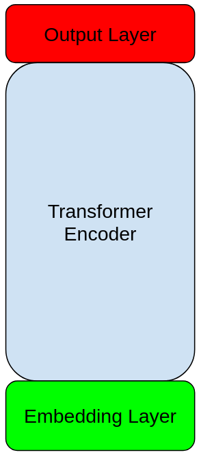
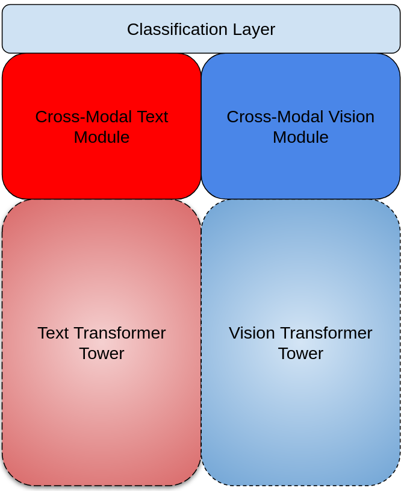

# Renaissance: A Multimodal Transformr Modeling Platform

Reanissance is a straight-forward modeling platform that allows the user to train and test a variety of vision-language model configurations with minimal programming requirements. The novel feature of this platform is that models from the Huggingface hub can be easily plugged into text and vision transformer modules. This allows users to easily test and train a huge variety of novel models with relatively little programming.   

## Model Types

Renaissance currently supports two types of encoder-only models: the one-tower encoder and the two-tower encoder. 

The one-tower encoder consists of an embedding layer, an encoder module and a output layer. The encoder module can be a drawn from number of transformer encoders available on the huggingface hub. Currently only BERT-style word-piece text embeddings and image patch embeddings are available. 



The tow-tower encoder consists of a text-encoder, an image-encoder and a cross-modal fusion encoder
followed by an output layer. The text-encoder and the image-encoder can be drawn from a number of models available on huggingface. The fustion encoder is always manually configured and trained from scratch.




## Install

```bash
pip install -r requirements.txt
pip install -e .
```

## Pre-trained Checkpoints

Here are the pre-trained models:


## Dataset Preparation

Dataset preperation and usage is described in DATA.md.

## Pretraining Models

## Finetuning and Evaluation


## Citation

```
@inproceedings{dou2022meter,
  title={An Empirical Study of Training End-to-End Vision-and-Language Transformers},
  author={Dou, Zi-Yi and Xu, Yichong and Gan, Zhe and Wang, Jianfeng and Wang, Shuohang and Wang, Lijuan and Zhu, Chenguang and Zhang, Pengchuan and Yuan, Lu and Peng, Nanyun and Liu, Zicheng and Zeng, Michael},
  booktitle={Conference on Computer Vision and Pattern Recognition (CVPR)},
  year={2022},
  url={https://arxiv.org/abs/2111.02387},
}
```

## Acknowledgements

The code is based on [ViLT](https://github.com/dandelin/ViLT) licensed under [Apache 2.0](https://github.com/dandelin/ViLT/blob/master/LICENSE) and some of the code is borrowed from [CLIP](https://github.com/openai/CLIP) and [Swin-Transformer](https://github.com/microsoft/Swin-Transformer).
